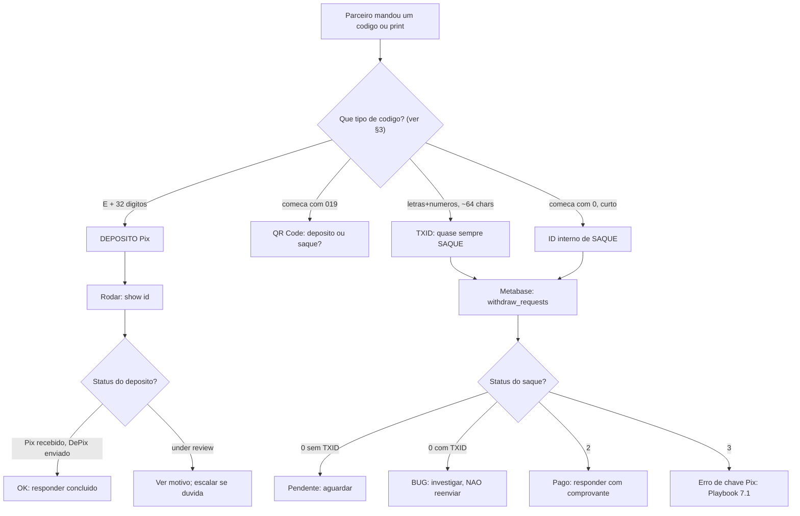

# Manual Operacional do Bot Pix (Eulen Bot / pix2depixd)

> [!IMPORTANT]
> **Todo comando do bot é IRREVERSÍVEL depois do Enter — não existe "desfazer".** Comandos de impacto
> financeiro — `/refund`, `/refundwithdraw`, os comandos de aprovação de saque, `/retrywithdrawal`,
> `/setauto` — exigem **double-check** com o responsável de Antifraude antes de executar enquanto você
> não tiver prática. Ver [§10](#10-irreversibilidade-e-protocolo-de-double-check).

*(Versão sanitizada — nomes de nós/processadoras, hosts internos, PII e links de incidentes/reuniões
foram removidos.)*

---

## Índice

1. [Visão geral e propósito](#1-visão-geral-e-propósito)
2. [Pré-requisitos e acesso](#2-pré-requisitos-e-acesso)
3. [Taxonomia de identificadores (ler primeiro)](#3-taxonomia-de-identificadores-ler-primeiro)
4. [Status de transação](#4-status-de-transação)
5. [Triagem: por onde começar](#5-triagem-por-onde-começar)
6. [Comandos essenciais do dia-a-dia](#6-comandos-essenciais-do-dia-a-dia)
7. [Playbooks operacionais](#7-playbooks-operacionais)
8. [Achar e ler um saque no Metabase](#8-achar-e-ler-um-saque-no-metabase)
9. [Auditoria manual e reconciliação](#9-auditoria-manual-e-reconciliação)
10. [Irreversibilidade e protocolo de double-check](#10-irreversibilidade-e-protocolo-de-double-check)
11. [Referência completa de comandos (`/help`)](#11-referência-completa-de-comandos-help)
12. [Glossário](#12-glossário)

> Para **atendimento ao parceiro** (o que responder a cada pedido), ver o
> [Playbook de Atendimento](atendimento-parceiro-playbook.md).

---

## 1. Visão geral e propósito

Este manual cobre o **Eulen Bot (private)** — o bot que executa os comandos de **operação** no grupo de
log (onde a atividade da operação aparece em tempo real). Por ele você:

- consulta o estado de **depósitos** (Pix → DePix) e **saques** (DePix → Pix);
- executa **devoluções** e reenvios;
- gerencia **parceiros** (habilitar, desabilitar, permissões) e **clientes finais** (bloquear/desbloquear);
- gera **relatórios** de movimentação.

> [!NOTE]
> **Não confunda os três atores do Telegram:**
> - **Eulen Bot (private)** — o **bot** de **operação**, no grupo de log. Executa os comandos deste
>   manual; o `/help` é dele.
> - **Bot público de parceiro** — o **bot** nos grupos B2B de parceiro; recebe os comandos
>   partner-facing (`/qr`, QR estático, etc.).
> - **Mike** — uma **conta de Telegram** (userbot, **não** um bot de comandos) nos grupos de parceiro,
>   usada para **comunicação** com o parceiro.

**Quem usa:** a equipe de operações (Customer Success/Onboarding e Antifraude).

---

## 2. Pré-requisitos e acesso

### Autorização

O bot só responde a usuários **autorizados** dentro do grupo. Para autorizar um operador novo, ele deve
enviar **`/ping`** no Eulen Bot (grupo de log). Comandos sensíveis exigem **sessão GPG desbloqueada**;
o desbloqueio é feito com **`/unlock [<horas>]`** (padrão 4h — use só num ambiente seguro).

### Qual grupo / qual bot

| Contexto | Grupo | Quem responde |
|---|---|---|
| **Operação** (consultas, saques, devoluções, gestão) | grupo de log | **Eulen Bot (private)** |
| Comandos do **parceiro** (`/qr`, QR estático) | grupo do parceiro | **bot público de parceiro** |
| **Comunicação** com o parceiro | grupo do parceiro | **Mike** (conta de Telegram) |

### Ferramentas adjacentes

- **Metabase** — BI central. Saques **não aparecem** no `/show`; toda a análise de saque é feita ali
  (tabela `withdraw_requests`; extrato limpo em `bank_tx`). Ver [§8](#8-achar-e-ler-um-saque-no-metabase).
- **Transcrição de imagem** — para transcrever o código de um comprovante enviado como imagem.
- **Explorador de blockchain (Liquid)** — para validar a existência de um **TXID** (ver [§9](#9-auditoria-manual-e-reconciliação)).
- **Extrato bancário** — conferência manual quando o bot/Metabase não dão certeza suficiente.

---

## 3. Taxonomia de identificadores (ler primeiro)

| Identificador | Formato | O que é | Onde usar |
|---|---|---|---|
| **E2E** (End-to-End / BACEN) | `E` + **32 dígitos** (só números) | **Depósito** Pix | `/show <id>` |
| **QR Code** | Começa com **`019…`** (o prefixo muda com o tempo) | Depósito ou saque (depende do contexto) | conforme o caso |
| **TXID** (DePix / Liquid) | String longa (~64 chars), letras e números | Movimentação on-chain de DePix; investigação por TXID é quase sempre de saque | explorador; Metabase de saques |
| **ID interno de saque** | `0` + sequência numérica curta | Identificador interno do saque | comandos de aprovação, `/cancelwithdrawal`, `/retrywithdrawal`, `/refundwithdraw` |
| **euid** | ID interno do cliente final (Eulen user ID) | Identifica um cliente final | `/userinfo`, `/report user`, `/blockenduser` |

Quando o parceiro manda um **comprovante como imagem**, recorte a região do código, transcreva-o e use no
comando apropriado.

---

## 4. Status de transação

### 4.1 Depósito

O `/show <txid>` mostra o estado de um **depósito**:

- **"Pix recebido, DePix enviado"** → concluído.
- **`under review`** (modo manual) → tem um **motivo** associado. O sistema coloca um depósito em revisão
  manual quando ocorre uma destas condições:
  - **Divergência de pagador** — nome e/ou CPF de quem pagou não bate com o pagador esperado do QR.
  - **Limite diário de depósito** excedido (cliente novo tem limite menor, que sobe após 24h).
  - **Alta frequência** — a partir do 3º depósito numa janela móvel de 30 min.
  - **CPF bloqueado** na blocklist interna.
  - **ISPB bloqueado** (instituição de origem na blocklist).

Transações em revisão **não são rejeitadas automaticamente**. Em caso de dúvida, pergunte antes de agir.

### 4.2 Saque

Saques são analisados no **Metabase** (tabela `withdraw_requests`) — ver [§8](#8-achar-e-ler-um-saque-no-metabase).

| Status | Significado | Ação |
|---|---|---|
| `0` **sem** TXID | Pendente — o parceiro ainda não enviou os DePix | Aguardar (caminho feliz) |
| `0` **com** TXID preenchido | ⚠ **Bug**: recebemos os DePix (o TXID prova), mas não houve tentativa de envio | **Investigar antes de qualquer ação** |
| `2` | Pago | Nada a fazer |
| `3` | Erro (na maioria, **chave Pix inválida**) | Ver [Playbook 7.1](#71-chave-pix-inválida-status-3) |
| `4` | Cancelado manualmente | — |

> [!CAUTION]
> Saque em status `0` **com TXID preenchido** significa que o DePix foi recebido mas o envio nunca foi
> tentado. **Não dispare comandos de aprovação, `/retrywithdrawal` ou `/refundwithdraw` às cegas** — pode
> já ter sido enviado por outro caminho, e reexecutar gera **envio em dobro**. O próprio `/help` avisa:
> *"o txID pode ser falso, confira a carteira com cuidado"*. Confirme manualmente (Metabase + extrato +
> explorador) antes de agir.

> [!NOTE]
> Os códigos numéricos (`0/2/3/4`) são o modelo **legado**. Há um refactor em curso para um modelo
> append-only com domínios independentes (`QRCODE`, `BANK`, `BLOCKCHAIN`, `WITHDRAW`) e reason codes. Até
> a migração concluir, os status numéricos continuam válidos no Metabase.

---

## 5. Triagem: por onde começar

O ponto de entrada quase sempre é o mesmo: **um parceiro colou um código (ou print) no Telegram.**

Regras de ouro: primeiro caractere decide o tipo; **saque nunca aparece no `/show`** (vá ao Metabase); e
**antes de qualquer comando que mexe em dinheiro**, confirme o status e, sem prática, faça double-check.

---

## 6. Comandos essenciais do dia-a-dia

"Reversível?" = **Leitura** (read-only), **Protegido** (o Pix ou um guard limitam o estrago) ou **Não**
(irreversível após sucesso).

### 6.1 Consulta

| Comando | Função | Sintaxe | Reversível? |
|---|---|---|---|
| `/show` | Inspecionar um **depósito** | `/show <txid>` | Leitura |
| `/listpending` (`/lp`) | Listar depósitos pendentes | `/listpending [pix2fa] [old\|new]` | Leitura |
| `/userinfo` | Dados do cliente final: nome, euid, CPF, quanto comprou hoje, teto, status de bloqueio | `/userinfo <euid\|taxnumber>` | Leitura |
| `/check` (`/ck`) | Panorama de pendências | `/check` | Leitura |
| `/balance` | Saldo / soma dos DePix com pagamento adiado | `/balance` | Leitura |
| `/ping` | Autorizar um operador novo no grupo | `/ping` | Leitura |

> [!WARNING]
> `/userinfo` expõe **PII** (nome, CPF). **Redija dados pessoais em prints antes de compartilhar** — já
> houve incidente de vazamento de PII por print. Pegue o **euid** aqui e use no `/report user`.

### 6.2 Relatórios

| Comando | Sintaxe |
|---|---|
| `/report` | `/report <deposit\|bank\|withdraw> YYYY/MM/DD YYYY/MM/DD [comma\|semicolon]` |
| `/report user` | `/report user <euid> <year> [comma\|semicolon]` |
| `/reportmonth` | `/reportmonth <bank> YYYY/MM [comma\|semicolon]` |

### 6.3 Depósitos — devoluções e holds

| Comando | Função | Sintaxe | Reversível? |
|---|---|---|---|
| `/refund` | Devolver um **depósito** (mecanismo nativo do Pix) | `/refund <banktxid> [force]` | Protegido |
| `/batchrefund` | Devolver todos os holds abertos com um dado `reason_code` — máx. 50, **sem `force`** | `/batchrefund <reason_code>` | Protegido |
| `/cancel` | Cancelar pagamento(s) DePix agendado(s) | `/cancel <id1,id2,…> [force]` | Não |
| `/setauto` | Soltar a transação: derruba a **pilha inteira** de holds | `/setauto <id> <resolution_code> [evidence…]` | **Não** |
| `/resolve` | Fechar **um** hold específico | `/resolve <id> <reason_code> <resolution_code> [evidence…]` | **Não** |
| `/setmanual` | Colocar transação(ões) em modo manual | `/setmanual <txid1> [<txid2>…]` | — |
| `/retry` | Retentar um **depósito** que falhou | `/retry <id> [force]` | **Não** |

> [!IMPORTANT]
> `/setauto` recebe **um id + um `resolution_code`** obrigatório (evidência opcional). Para fechar só um
> dos holds de uma transação segurada por vários motivos, use `/resolve` — é também o único caminho do
> operador para limpar um hold de Pix2FA (`/resolve <id> PIX_2FA TWO_FA_OVERRIDE`).
>
> **`reason_code`** (por que o hold abriu): `PIX_2FA` · `PIX_2FA_SEND_ERROR` · `PAST_DAILY_LIMIT` ·
> `DELAY` · `BLOCKED_USER` · `BLOCKED_ISPB` · `BLOCKED_BANK_NUMBER` · `UNKNOWN_CLIENT` · `HIGH_VELOCITY` ·
> `PAYER_MISMATCH` · `PAYER_VERIFICATION_FAILED` · `SEND_ERROR` · `FRAUD_FLAGGED` · `MANUAL_OPERATOR` ·
> `MANUAL_WITHDRAWAL` · `LEGACY_MANUAL` · `PAID_AFTER_EXPIRATION` · `COMPLIANCE_REVIEW` · `COMPLIANCE_BLOCKED`.
>
> **`resolution_code`** (por que o hold fechou): `OPERATOR_VERIFIED` · `FALSE_POSITIVE` ·
> `RULE_NO_LONGER_FIRES` · `REFUNDED` (carimbado sozinho por comando de devolução) · `PARTNER_CONFIRMED`
> (só no hold `UNKNOWN_CLIENT`, via `/setpartner`) · `TWO_FA_OVERRIDE`. Texto livre **nunca** entra nesses
> campos — vai em `metadata`.

### 6.4 Saques — **comandos são por banking node**

Não existe um `/approve` genérico: a aprovação depende do **banking node**. Os nomes de comando são
**legado** e cada um aprova por um banking node diferente — confirme qual atende o saque antes.

| Comando | Função | Sintaxe | Reversível? |
|---|---|---|---|
| `/approvefitbank` (`/apfb`) | Aprovar saque por um banking node | `/approvefitbank <id\|txID> [force]` | **Não** |
| `/approvesqala` (`/apsq`) | Aprovar saque por outro banking node | `/approvesqala <id\|txID> [force]` | **Não** |
| `/retrywithdrawal` | Retentar um saque que falhou (status `3`) | `/retrywithdrawal <id\|txId> [force]` | **Não** |
| `/refundwithdraw` | Devolver o valor de um saque para a carteira Liquid do parceiro | `/refundwithdraw <id> <liquid-address> [force]` | **Não** |
| `/cancelwithdrawal` | Cancelar um saque pendente | `/cancelwithdrawal <id\|txid> [force]` | Não |
| `/deletewithdrawal` | Apagar um saque (valor declarado errado, ou tx expirada feita depois) | `/deletewithdrawal <txid> [force]` | **Não** |
| `/listwithdrawals` (`/lw`) | Listar saques | `/listwithdrawals [old\|new]` | Leitura |
| `/listpendingwithdraw` (`/lpw`) | Listar saques **travados** (status `Error` / `Sending`) | `/listpendingwithdraw [old\|new]` | Leitura |
| `/setmanualwithdraw` (`/smw`) | Colocar um saque em modo manual | `/setmanualwithdraw <withdrawID>` | Protegido |
| `/markwithdrawalassent` | Marcar um saque como enviado | `/markwithdrawalassent <txid> [force]` | Protegido |

> [!CAUTION]
> Nos comandos de aprovação, **o `txID` pode ser falso**: **confira a carteira com cuidado** antes de
> aprovar. `force` é necessário quando o depósito original não corresponde ao novo link (ver [7.2](#72-divergência-de-valor-acima-de-5)).
> Antes de `/refundwithdraw`, **confirme o endereço Liquid com o parceiro**.

### 6.5 Gestão de parceiros

| Comando | Função | Sintaxe | Reversível? |
|---|---|---|---|
| `/addpartner` | Adicionar um parceiro novo (hoje automatizado pelo onboarding) | ver [add-partner](../onboarding/add-partner.md) | — |
| `/disable` / `/enable` | Desabilitar / reabilitar um parceiro | `/disable <partnerid>` · `/enable <partnerid>` | Sim |
| `/setnewuserslimit` | Limite (em **centavos**) para **novos** clientes do parceiro | `/setnewuserslimit <partnerid> <limite-em-centavos>` | Sim |
| `/setqrdelayfloor` | QR delay mínimo (horas) que permite o cliente novo ultrapassar o limite de novos usuários | `/setqrdelayfloor <partnerid> <horas\|clear>` | Sim |
| `/addpermission` / `/removepermission` | Permissões finas por parceiro | `/addpermission <partnerid> <permissão> [true\|false]` | Sim |

> [!NOTE]
> `/setnewuserslimit` é **em centavos**: R$ 10 = `1000`, R$ 500 = `50000`. Responde ao pedido clássico
> "meu cliente queria comprar R$ 500 e travou em R$ 10". Acima do teto de novo usuário, só com
> identificação — ou aceitando o `/setqrdelayfloor`.

### 6.6 Cliente final

| Comando | Função | Sintaxe | Reversível? |
|---|---|---|---|
| `/blockenduser` | Bloquear um cliente final | `/blockenduser <euid\|taxnumber>` | Sim (`/unblockenduser`) |
| `/unblockenduser` | Desbloquear um cliente final | `/unblockenduser <euid\|taxnumber>` | — |
| `/listblockedusers` | Listar clientes bloqueados | `/listblockedusers` | Leitura |
| `/userinfo` | Consultar um cliente final | `/userinfo <euid\|taxnumber>` | Leitura |
| `/af_report` (`/screen`) | Dossiê antifraude em PDF, entregue **por DM** | `/af_report [<cpf\|cnpj\|euid>,…]` | Protegido |

> [!IMPORTANT]
> `/af_report` consulta o antifraude **sob demanda**. Isso é independente do gate automático de screening
> na criação do QR: a **ausência de bloqueio automático não significa que o parceiro passou por triagem**.
> Quando o caso cheirar mal, rode o `/af_report` você mesmo.

---

## 7. Playbooks operacionais

### 7.1 Chave Pix inválida (status `3`)

O erro de saque mais comum. Quando o parceiro reporta "chave não encontrada":

1. Confirme no Metabase que o status é `3`.
2. Pergunte ao parceiro o que ele quer:
   - **Reenviar** → `/retrywithdrawal <id|txId> [force]` (após corrigir a chave).
   - **Devolver** → `/refundwithdraw <id> <endereço-liquid> [force]`.
3. **Confirme o endereço com o parceiro** antes de devolver.

> Não dá para **alterar** uma chave Pix ou o valor de um saque já criado. O parceiro precisa **solicitar
> um novo saque** — e só conseguimos ajudar se o anterior **ainda não foi enviado**.

### 7.2 Divergência de valor acima de 5%

- O sistema tolera até **5%** de divergência (envia o valor recebido). **Acima de 5%, o bot ignora** o
  pagamento e a transação fica em revisão.
- Fluxo: confirme a divergência no grupo interno (o bot loga o percentual exato); confirme que o parceiro
  criou um **novo link** com o valor que efetivamente caiu; pegue o ID do **novo** saque e aprove pelo
  banking node certo, **com `force`** (necessário porque o depósito original não corresponde ao novo link).

> Confundir o **ID novo** com o antigo causa envio indevido. **Confira a carteira** e, sem prática, mande
> para double-check.

### 7.3 Saque travado por limite diário

Saques que aparecem no `/check` com status `0` por terem estourado o limite diário:

- **Procedimento correto:** aguardar a **virada do dia** e aprovar pelo banking node.
- **Não** use `/retrywithdrawal` nem `/refundwithdraw` — o saque é válido; só o limite precisava renovar.

> **Limites:** ver a tabela dos três no [FAQ](faq-atendimento.md). O diário por CPF/CNPJ é configurável
> por nível, então **não afirme um número** — consulte `maxDailyInCents` com `/userinfo <euid>`. Não há
> teto de valor por QR fora dos dois gates de identificação (R$ 10,00 sem nada enviado, R$ 500,00 com CPF
> enviado e sem histórico).

### 7.4 DePix não chegou na carteira

- **1ª hipótese (mais provável na primeira compra):** o ativo está **oculto por padrão** na carteira.
  Oriente o cliente a habilitar a visualização do DePix.
- Se for **segunda compra ou posterior**, parte para investigação (extrato, TXID; ver [§9](#9-auditoria-manual-e-reconciliação)).

### 7.5 Sistema pausado (retomar envios)

Quando o sistema é pausado (`/pause`), as transações pausam junto. Para retomar: `/resume`, e coloque
cada transação represada de volta em automático com `/setauto <id> <resolution_code>` — **uma por vez**
(normalmente `RULE_NO_LONGER_FIRES`). O oposto, `/setmanual <txid…>`, aceita lista.

---

## 8. Achar e ler um saque no Metabase

Saques **não aparecem no `/show`** — vivem no Metabase.

1. Abra a consulta de **`withdraw_requests`** (o extrato "limpo" de depósitos é a `bank_tx`).
2. **Busque o saque pelos dois identificadores possíveis** — o **ID interno** (começa com `0`) **ou** o
   **TXID** (string longa). Procure **na coluna certa**: eles ficam em colunas diferentes.
3. **Leia o status** (`0/2/3/4` — ver [§4.2](#42-saque)).
4. **Olhe a coluna de endereço de recebimento / TXID:**
   - Preenchida → **recebemos os DePix** do parceiro.
   - status `0` + coluna vazia → pendente normal; status `0` + coluna preenchida → ⚠ bug (investigar);
     status `3` + coluna preenchida → erro de envio → [Playbook 7.1](#71-chave-pix-inválida-status-3).
5. **Saque sem comprovante:** cruzar transação a transação com o extrato do banco (ver [§9](#9-auditoria-manual-e-reconciliação)
   e [withdraw-docs](withdraw-docs.md)).

---

## 9. Auditoria manual e reconciliação

1. **Comprovante (imagem) → código:** recorte, transcreva e rode `/show <id>`.
2. **TXID no explorador de blockchain:** cole o TXID num explorador Liquid público. Retorna → existe
   on-chain; não retorna → sinal de alerta. ⚠ O explorador **não mostra o valor** de forma confiável — a
   fonte de verdade do valor é o `/show`.
3. **Extrato bancário:** quando bot/Metabase não fecham, confirme direto no extrato.
4. **Hábito de reconciliação:** ao mover fundos **manualmente** da carteira operacional, **anote o valor**
   no chat.
5. **Erros conhecidos de saque** estão catalogados em [withdraw-docs](withdraw-docs.md).

> [!CAUTION]
> Quando uma transação que deveria existir **não aparece** no explorador, ou há divergência sem
> explicação, **não tente resolver sozinho** — escale.

---

## 10. Irreversibilidade e protocolo de double-check

**Princípio:** depois do Enter, **já foi**. Não há `undo`.

| Comando | Risco |
|---|---|
| `/show`, `/userinfo`, `/check`, `/report*`, `/balance`, `/list*` | **Leitura** — sem risco |
| `/refund` (depósito) | Financeiro, mas o Pix barra devolução duplicada. Risco = disparar a 1ª vez sem precisar |
| `/setauto` / `/setmanual` | Sem reversão se aplicado errado numa janela crítica |
| Comandos de aprovação de saque, `/retrywithdrawal`, `/refundwithdraw`, `/deletewithdrawal` | **Sem reversão** após o sucesso |

**Protocolo enquanto ganha prática:** atenda o parceiro, identifique o caso e, **antes de cada comando
crítico**, mande o resumo para o Antifraude ("parceiro pediu devolução deste id, identifiquei assim, posso
seguir?"). Ele faz o double-check e libera.

---

## 11. Referência completa de comandos (`/help`)

`[ ]` = opcional; `<>` = obrigatório; `(/xx)` = alias curto; 🔒 = **exige sessão GPG desbloqueada**.

### Depósitos (pix2depix)

| Comando | Sintaxe |
|---|---|
| Cancelar | `/cancel <id1,id2,id3…> [force]` |
| Listar cancelados | `/listcanceled` |
| Listar pendentes (`/lp`) | `/listpending [pix2fa] [old\|new]` |
| Listar em envio / enviados | `/listsending` · `/listsent` |
| Marcar como enviado | `/markassent <id>` |
| Rebroadcast (`/rebc`) | `/rebroadcast <txid1> [txid2…]` 🔒 |
| Resolver **um** hold | `/resolve <id> <reason_code> <resolution_code> [evidence…]` |
| Retentar | `/retry <id> [force]` |
| Modo automático (derruba a pilha toda de holds) | `/setauto <id> <resolution_code> [evidence…]` |
| Modo manual | `/setmanual <txid1> [<txid2>…]` |
| Definir parceiro da tx | `/setpartner <txid> <partnerid>` — *resolve o hold `UNKNOWN_CLIENT` e só ele* |
| Mostrar | `/show <txid>` |
| Devolver depósito | `/refund <banktxid> [force]` 🔒 |
| Devolver em lote por motivo | `/batchrefund <reason_code>` 🔒 — *máx. 50 por execução, sem `force`* |
| Fallback de webhook | `/webhookfallback` |

### Saques (depix2pix)

| Comando | Sintaxe |
|---|---|
| Aprovar por banking node (`/apfb`) | `/approvefitbank <id\|txID> [force]` 🔒 — *o txID pode ser falso, confira a carteira* |
| Aprovar por banking node (`/apsq`) | `/approvesqala <id\|txID> [force]` 🔒 — *o txID pode ser falso, confira a carteira* |
| Cancelar saque | `/cancelwithdrawal <id\|txid> [force]` |
| Apagar saque | `/deletewithdrawal <txid> [force]` 🔒 |
| Listar saques (`/lw`) | `/listwithdrawals [old\|new]` |
| Listar saques travados (`/lpw`) | `/listpendingwithdraw [old\|new]` — *status `Error` / `Sending`* |
| Saque em modo manual | `/setmanualwithdraw <withdrawID>` 🔒 |
| Marcar saque como enviado | `/markwithdrawalassent <txid> [force]` 🔒 |
| Retentar saque | `/retrywithdrawal <id\|txId> [force]` 🔒 |
| Devolver saque | `/refundwithdraw <id> <liquid-address> [force]` 🔒 |

### Fundos e relatórios

| Comando | Sintaxe |
|---|---|
| Saldo | `/balance` |
| Relatório | `/report <deposit\|bank\|withdraw> YYYY/MM/DD YYYY/MM/DD [comma\|semicolon]` 🔒 |
| Relatório de carteira | `/report wallet [maxtransactions] [skip] [comma\|semicolon]` 🔒 |
| Relatório de usuário | `/report user <euid> <year> [comma\|semicolon]` |
| Relatório mensal | `/reportmonth <bank> YYYY/MM [comma\|semicolon]` 🔒 |
| Saque interno (`/ww`) | `/withdraw <value> <banking-node> [<pixkey>]` — *a pixkey precisa estar na whitelist* |

### Chaves Pix (banking node)

| Comando | Sintaxe |
|---|---|
| Cancelar / criar chave | `/cancelpixkey <pixkey>` 🔒 · `/createpixkey <pixkey>` 🔒 |
| Criar chave aleatória | `/createrandompixkey` 🔒 |
| Confirmar chave | `/confirmpixkey <pixkey> <token>` 🔒 |
| Listar chaves | `/listpixkeys` |
| Reenviar token da chave | `/resendpixkeytoken <pixkey>` 🔒 |
| Transferir p/ conta de impostos | `/transfertotaxaccount <value>` 🔒 |

### Parceiros

| Comando | Sintaxe |
|---|---|
| Adicionar parceiro | `/addpartner <partnerid> "<name>" <telegram-group-id> <pixkey-for-deposit> <depix-address-for-deposit> <depix-address-for-withdrawal> [<pixkey-for-withdrawal>] [<split-address>] [<split-fee>]` 🔒 |
| Desabilitar / habilitar | `/disable <partnerid>` · `/enable <partnerid>` |
| Remover parceiro | `/removepartner <partnerid>` 🔒 |
| Adicionar / remover permissão | `/addpermission <partnerid> <permission> [true\|false]` · `/removepermission <partnerid> <permission>` |
| Definir banking node | `/setbankingnode <partnerid> <banking-node-id>` 🔒 |
| Definir node de QR estático | `/setclientstaticpixnode <partnerid> <banking-node-id\|simple-name\|default\|clear\|none>` 🔒 |
| Ocultar tax number | `/sethidetaxnumber <partnerid> <cpf\|all\|none>` |
| Limite de novos usuários | `/setnewuserslimit <partnerid> <new-users-limit>` 🔒 — *em centavos* |
| QR delay mínimo | `/setqrdelayfloor <partnerid> <hours\|clear>` 🔒 |

### Cliente final

| Comando | Sintaxe |
|---|---|
| Dossiê antifraude (`/screen`) | `/af_report [<cpf\|cnpj\|euid>,…]` 🔒 — *PDF por DM; sem argumento, abre upload de CSV para lote* |
| Bloquear / desbloquear | `/blockenduser <euid\|taxnumber>` · `/unblockenduser <euid\|taxnumber>` 🔒 |
| Listar bloqueados | `/listblockedusers` |
| Info do usuário | `/userinfo <euid\|taxnumber>` |

### Sistema

| Comando | Sintaxe |
|---|---|
| Autorizar parceiro / usuário | `/addauthpartner <telegram-user-id> <partner-id>` 🔒 · `/addauthuser <telegram-user-id> <username> <group> <gpg-key-id>` 🔒 |
| Blacklist de banco (`/atb` / `/rfb`) | `/addtoblacklist <ispb\|bank-number>` 🔒 · `/removefromblacklist <ispb\|bank-number>` 🔒 |
| Check (`/ck`) | `/check` |
| Limpar warnings | `/clearwarnings` |
| Ajuda | `/help` |
| Pausar / retomar | `/pause` · `/resume` |
| Ping | `/ping` |
| Recarregar config | `/reload` |
| Shutdown | `/shutdown` |
| Desbloquear sessão GPG | `/unlock [<hours>] [<telegram-user-id>]` 🔒 — *padrão 4h; use só num ambiente seguro* |

---

## 12. Glossário

- **DePix** — stablecoin lastreada 1:1 em BRL, emitida na rede Liquid.
- **Liquid** — sidechain do Bitcoin onde o DePix circula. Endereços começam com `lq1…` ou `VJL…`/`VL…`.
- **E2E (End-to-End ID)** — identificador único de um Pix atribuído pelo BACEN. `E` + 32 dígitos.
- **QrId** — identificador de um QR Code gerado pelo sistema. Começa com `019…`.
- **TXID** — identificador de uma transação on-chain de DePix (Liquid). ~64 chars.
- **euid** — Eulen user ID, o identificador interno de um cliente final.
- **banktxid** — identificador da transação bancária de um depósito (usado no `/refund`).
- **MED** — Mecanismo Especial de Devolução do Pix (contestação). Ver [contestação de MED](med-contestacao-guia-operacional.md).
- **ISPB** — identifica a instituição de origem de um Pix.
- **Banking node** — nó que representa a integração com um adquirente/banco. Define qual comando de
  aprovação de saque usar.
- **Modo manual (`under review`)** — depósito que aguarda análise humana ([motivos](#41-depósito)).
- **Pix2FA** — verificação anti-fraude (código de R$ 0,01) para novos usuários.
- **QR Delay** — atraso programado do pagamento de DePix (1h a 720h) para checar se há MED antes de liberar.

Vocabulário completo: [glossário da base](../glossario.md).
